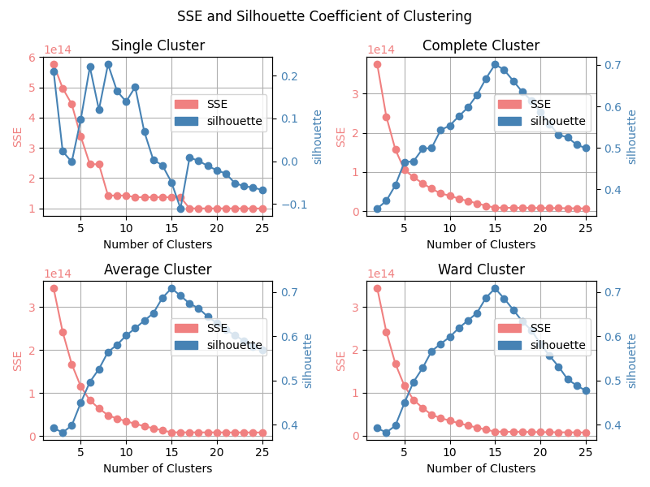

[toc]

## 项目简介

请参见 `report.md` 或 PDF。

> 所有代码经过充分测试，保证手写实现的结果与库函数结果一致，保证了代码的正确性。且所有代码经过充分优化，时空效率较优。

## 运行方法

请安装如下依赖：

- `numpy` 用于优化运算时空效率
- `matplotlib` 用于绘制图表
- `sklearn` 用于绘制图表、协同过滤

项目主函数入口在 `main.py`，使用命令行参数来选择执行内容。

运行环境要求：请至少准备 2GB 以上

支持的运行功能的详细介绍：(若 Linux，可以把 `python` 改为 `python3` 等)

1. > 系统自检：输出 OK，表示相关依赖安装正常。
   >
   > ```sh
   > python main.py --check
   > ```

2. 对给定数据 `8gau.txt`，执行层次聚类，生成结果。

   1. 使用预先运行好的层次聚类结果绘图，**绘制四种聚类结果**。结果直接展示。

      ```sh
      python main.py --cluster plot
      ```

      > 如果要保存结果(不展示)，修改为：
      >
      > ```sh
      > python main.py --cluster plot --save
      > ```
      >
      > 此时会把结果保存在项目根目录 `cluster_results.png`。

   2. **计算 SSE 和轮廓系数**，绘图展示。

      鉴于轮廓系数计算耗时较久，需要等待大约两分钟。

      ```sh
      python main.py --cluster stat
      ```

      > 如果要保存结果(不展示)，修改为：
      >
      > ```sh
      > python main.py --cluster stat --save
      > ```
      >
      > 此时会把结果保存在项目根目录 `both_partial.png`。表示两个结果(both)的部分(partial)分类(k<=25)结果。

   3. **绘制层次聚类的步骤**，保存到本地。

      ```sh
      python main.py --cluster step
      ```

      图片较复杂，需要等待一段时间绘制。会将四种结果聚类的步骤，按课件的样式(lec4, 58页)展示，保存到磁盘项目根目录，分别为：

      - 最小聚类 `single_clustering_steps.png`
      - 最大聚类 `complete_clustering_steps.png`
      - 平均聚类 `average_clustering_steps.png`
      - ward聚类 `ward_clustering_steps.png`

   4. 对原数据集进行层次聚类，生成聚类结果(聚类步骤记录)。

      ```sh
      python main.py --cluster generate
      ```

      该结果用于三个绘图展示。已经预先计算过，但是可以重新计算。总共需要大约1分钟。得到的结果记录为：

      - 最小聚类 `steps_single.txt`
      - 最大聚类 `steps_complete.txt`
      - 平均聚类 `steps_average.txt`
      - ward聚类 `steps_ward.txt`


## 项目目录

### 代码

介绍代码和关键函数。部分核心函数的讲解参见下面 `核心原理` 一节。

#### 层次聚类

- `main.py` 主函数入口
- `disjointSet.py` 各种手写并查集，用于实现层次聚类各功能
  - `DSU` 手写并查集的类
  - `DSU_average` 维护组平均距离的并查集子类
  - `DSU_ward` 维护ward、各点坐标和的并查集子类
  - `DSU_SSE` 维护各点坐标和、坐标平方和以求SSE的并查集子类
  - `getClassess()` 根据并查集求出聚类结果标签
- `cluster.py` 四种层次聚类(最小、最大、组平均、ward)的核心代码
  - `cluster()` 层次聚类总函数
  - `minCluster()` 最小聚类
  - `maxCluster()` 最大聚类
  - `averageCluster()` 组平均聚类
  - `wardCluster()` ward聚类
  - `HeapReconstructor` 手写重构堆结构类，用于代码优化
- `cluster_criteria.py` 层次聚类评价指标(SSE、轮廓系数)和绘图代码
  - `calcSSEs()` 求SSE指标
  - `calcSilhouette()` 求轮廓系数指标
  - `plotLines()` 绘制四种层次聚类的SSE、轮廓系数指标折线图
  - `plotAllTypesCluster()` 绘制四种层次聚类的聚类结果
  - `plotAllSteps()` 绘制四种层次聚类的聚类过程步骤
- `utils.py` 辅助函数，如读取数据集等
  - `readCSV()` 读取数据集 8gau.txt

#### GMM


### 数据

- `8gau.txt` 第一题(层次聚类+GMM)数据

#### 层次聚类

- `steps_single.txt` 最小聚类运行结果
- `steps_complete.txt` 最大聚类运行结果
- `steps_average.txt` 组平均聚类运行结果
- `steps_ward.txt` ward聚类运行结果

### 文档

- `README.md` 项目文档
- `img/` 文档和部分绘图结果
- `report.md` 报告文档

## 运行结果

详细解释见文档。

### 层次聚类

对四种层次聚类，SSE 和轮廓系数指标：



聚成 15 类的结果：


四种层次聚类的聚类步骤：

- 最小聚类

  

- 最大聚类

  

- 组平均聚类

  

- ward聚类

  

### GMM

对四种 GMM 初始化办法，其聚类结果 ($k=15$ 类，$seed=8146$) 如下：


## 技术细节

介绍关键算法的实现思路：

### 层次聚类

所有聚类的时间复杂度为 $O(n^2\log n)$，空间复杂度为 $O(n^2)$，达到理论最优，且进行了及其充分的常数优化。

核心技术：并查集、重构堆、numpy 优化。

> **知识摘要：**参照PPT，层次聚类是每次选择符合给定标准的最小两个类，将其聚合为一类，不断重复这个过程直到聚类完成，并保留聚类步骤。
>
> 1. 最小聚类：组间最小边最小的两类聚合
> 2. 最大聚类：组间最大边最小的两类聚合
> 3. 组平均聚类：组间平均边距离最小的两类聚合
> 4. ward聚类：组间重心加权平均最小的两类聚合

#### 最小聚类

> 核心代码：`disjointSet.py` 的 `DSU` 类，`cluster.py` 的 `minCluster()` 函数。

**并查集**是一种能够以 $O(\alpha)\approx O(1) < O(\log n)$ 的平均单次操作复杂度，优秀地实现：①合并两组、②查询每个点所在的组，这两个功能的数据结构。可以基于并查集进行扩展，以便在合并过程同时记录组信息的维护，这些信息可以是：组的点数、点坐标和等信息。

对最小聚类，使用并查集并**使用 `numpy` 高效排序**，把距离矩阵排序后按从小到大枚举每个距离及其点对，若该点对不在同一组，就把它们聚类合到一组。与朴素快速排序相比(8s)，`numpy` 排序可以优化到小于2s的排序时间。

> 具体运行时间根据 CPU 性能的不同而不同，本文以 i7-13620H 为例。

#### 最大聚类

> 核心代码：`disjointSet.py` 的 `DSU` 类，`cluster.py` 的 `maxCluster()` 函数。

使用并查集维护组间最大距离。初始最大距离等于距离矩阵，每次合并时，把这两行两列的距离矩阵合并，保留最大值。

仍然枚举原距离矩阵的个点对和距离，若该距离等于并查集维护的组间最大距离，那么当前枚举到了组间最大边，此时进行两组聚类合并。

注意到，在合并过程中，90% 的合并都在前面的一小部分排序后距离矩阵取得，但是遍历完后面的一大部分距离矩阵耗时很大。因此，考虑**进行重构优化**。当已经进行了大部分的聚类合并后，直接抛弃原来的距离矩阵，对剩下的小部分点构建一个新的较小的距离矩阵。通过这样的优化，可以**大大优化运行时间，从优化前需要上百秒运行时间，优化到只需要10秒左右。**

同样地，使用 `numpy` 数组进行了充分的优化。以距离矩阵为例，如果使用 Python List 实现，$5000^2$ 个 float 元素的二维列表需要至少 1GB 的空间，

#### 组平均聚类

> 核心代码：`disjointSet.py` 的 `DSU_average` 类，`cluster.py` 的 `HeapReconstructor` 类和 `averageCluster()` 函数。

仍然使用并查集，维护每个组的距离和、点数，用距离和除以点数就是平均距离。使用种类并查集的思想，每次合并后，给合并后的组添加一个新的虚拟节点，该节点的编号可以代表当前组的“版本”。

使用**优先级队列实现最小堆**，动态维护当前最小的“组平均距离”。与使用其他动态维护最小值的结构，如红黑树相比，最小堆的常数小、效率高，实验表明运行时间快数倍至数十倍。

最小堆无法删除任意元素，只能删除堆顶元素。所以使用懒惰删除策略实现更新。如果当前堆顶元素的“版本”不等于并查集当前组的“版本”，那么当前元素是更新前的旧元素，直接跳过即可。因此，每次合并两组后，直接往最小堆添加新的距离即可，旧的距离会被“版本”筛掉直接跳过。

类似地，使用 `numpy` 数组进行了充分的时空优化，并且使用了**重构堆技术**，即当发现当前堆删除元素的次数远大于合并组次数时，证明当前堆绝大部分都是旧的距离，可以直接清空堆，根据剩下的点重新构建一个新堆。同样地，根据这样的优化，可以优化到只需要20多秒即可跑完。

#### ward聚类

> 核心代码：`disjointSet.py` 的 `DSU_ward` 类，`cluster.py` 的 `HeapReconstructor` 类和 `wardCluster()` 函数。

两组距离公式为：两重心的距离的平方乘以点数的调和平均的二倍。重心的计算只需要维护当前组横纵坐标之和以及点数即可，这可以通过并查集实现。

类似于组平均，使用 `numpy` 数组、重构堆技术进行优化，可以优化到只需要15秒多即可跑完。

#### SSE计算

> 核心代码：`disjointSet.py` 的 `DSU_SSE` 类，`cluster_criteria.py` 的 `calcSSEs()` 函数。

层次聚类可以得到一个聚类的步骤，即从开始到结束每次合并哪两个点所在的组。SSE 就是每个组方差的和。对于方差，根据高工数结论有：
$$
\sum_{i=1}^n(X_i-\overline X)^2=\sum_{i=1}^nX_i^2-2n\overline X^2
$$
因此，使用**并查集**，维护每个组的横纵坐标和、点数、横纵坐标平方和，则可以在层次聚类过程中，**动态地维护**每个组的方差。再动态维护各组方差和即可。也就是说，**可以 $O(1)$ 地从 $k$ 个类的 SSE 转移到 $k-1$ 个类的 SSE。**因此可以做到只使用 $O(n)$ 的复杂度计算出分类为 $1,2,3,\cdots,n$ 个类的全部 SSE，复杂度非常优。

### GMM

#### 原理要点

参照机器学习和神经网络的代码设计思想，使用了面向对象编程，在 `gmm.py` 构建了 `GMM` 类(Gaussian Mixture Models)。

> 知识原理：
>
> 对本题所用的二维高斯(/正态)分布，设维度 $c=2$，均值向量 $\mathbf\mu\in\R^{c}$，协方差矩阵 $\mathbf\Sigma\in\R^{c\times c}$，输入向量 $\mathbf x\in\R^c$，其率密度函数矩阵表达式如下：
> $$
> p(\mathbf{x}|\mathbf\mu,\mathbf\Sigma) = \frac{1}{2\pi |\mathbf{\Sigma}|^{1/2}} \exp\left(-\frac{1}{2} (\mathbf{x} - \mathbf{\mu})^T \mathbf{\Sigma}^{-1} (\mathbf{x} - \mathbf{\mu})\right)
> $$
> 如果有很多个输入点 $X\in\mathbb R^{n\times c}$， 可以求出每个点的概率密度。
>
> 对GMM，假设由 $k$ 个二维高斯分布组成一个整体的分布，则概率密度函数为：
> $$
> p(\mathbf x) = \sum_{i=1}^{k}w_i \cdot p(\mathbf x |\mathbf \mu_i,\mathbf\Sigma_i)
> $$
> 也就是多个二维高斯分布加权平均，其中 $\sum_{i=1}^{k}w_i=1$。
>
> 给定样本 $X$ 和类别 $k$，从样本里学习到 $p(\mathbf x)$，然后把每个样本分类到离它“最近”的一个高斯分布成分里，就能实现将 $X$ 聚类为 $k$ 类。
>
> EM算法(期望最大化算法，Expectation-Maximum)是一种用于参数估计的迭代方法，常用于处理含有隐变量(具体到本题，每个数据点属于哪个高斯成分)的概率模型。EM算法的主要思想是通过迭代优化来寻找最大似然估计。该算法的步骤：
>
> 1. 初始化参数，即各 $\mathbf\mu_i,\mathbf\Sigma_i,w_i$。
>
> 2. 不断重复下面两步，直到更新变化小或迭代次数足够：
>
>    - E步(期望步)：计算每个数据点属于每个混合成分的后验概率。即：
>      $$
>      \gamma_{ij}=\dfrac{w_i p(\mathbf x_j|\mathbf\mu_i,\mathbf\Sigma_i)}{\sum_{i'=1}^kw_{i'} p(\mathbf x_j|\mathbf\mu_{i'},\mathbf\Sigma_{i'})}
>      $$
>      也就是各个样本的：各高斯成分概率密度函数加权占全部密度函数的比值。其中 $i$ 是类别编号，$j$ 是样本编号。含义为：$j$ 样本属于 $i$ 类别的概率(责任/权重)。
>
>    - M步(最大化步)：利用最大似然估计，分别更新 $\mathbf\mu_i,\mathbf\Sigma_i,w_i$。
>
>      求各成分的样本比值和($\gamma_{i\cdot}=\sum_{j=1}^n\gamma_{ij}$)，然后转为频率即同理 $\gamma'_{i\cdot}=\dfrac{\gamma_{i\cdot}}{\sum_{j=1}^k\gamma_{j\cdot}}$，然后认为这个比值频率就是新的 $w_i=\gamma'_{i\cdot}$。
>
>      为每个类用每个样本按责任 $\gamma_{ij}$ 来加权平均和求新的均值，即 $\mathbf\mu_i=\dfrac{\sum_{j=1}^n\gamma_{ij}X_{j}}{\gamma_{i\cdot}}$，其中 $\mathbf\gamma=[\gamma_{ij}]_{k\times n}$ 且 $\mathbf X=[x_{ij}]_{n\times c}$ 故等价于 $\mathbf\mu=\dfrac{\mathbf\gamma\mathbf X}{\mathbf\gamma_{i\cdot}}$。
>
>      求协方差，则使用方差加权 $\mathbf\Sigma_i=\dfrac{(\mathbf\gamma_i\cdot(\mathbf X-\mathbf\mu_i)^T)(\mathbf X-\mathbf\mu_i)}{\gamma_{i\cdot}}$。等价于：$\mathbf\Sigma_{i}=\dfrac1{\gamma_{i\cdot}}\sum_{j=1}^n\gamma_{ij}(\mathbf x_j-\mathbf\mu_i)(\mathbf x_j-\mathbf\mu_i)^T$。
>
>    - 更新完后，求各样本对数似然估计之和 $L=\sum_{j=1}^n\log\sum_{i=1}^kp(\mathbf x_j|\mathbf\mu_i,\mathbf\Sigma_i)$，看做损失函数，若该函数较上一轮变化较小，可以认为收敛，此时可以退出迭代。

#### 改进方法

> 核心代码：`gmm.py` 的三个类 `GMM, KMeans, KMedoids` 和函数 `GMMcluster()`。

基于上面的公式、步骤，项目实现了 GMM 类，设迭代轮次为 $t$，聚成 $k$ 类，点数为 $n$，维度为 $c=2$，则时间复杂度为 $O(tknc)=O(tkn)\approx O(nk)\approx O(n)$，这是因为 $k\approx15$ 较小，且 $t$ 实践表明也较小，只需要十轮左右即可完成收敛，所以认为 $c,k,t$ 都是小常数。空间复杂度为 $O(nkc)\approx O(n)$。全程**使用 numpy** 数组进行线性代数矩阵操作，大大**提高了运算效率**。

在上面的基础上，我们进行了改进：**数据标准化预处理**与**使用Kmeans++初始化权重**。

1. 标准化预处理。数据集范围较大，容易运算溢出。所以计算前，把数据集 $X$ 进行标准化，用 Z-scoring 使其变成均值 0，方差 1，即用 $\dfrac{X-\mu}{\sigma}$ 替代原数据集。

2. 初始化策略：我们**探索了多种不同的初始化策略，包括随机初始化、手写K-means初始化、手写K-medoids初始化、手写K-means++初始化**。对比了不同的结果，最终选择K-means++进行初始化。


探索的初始化具体如下：

1. 随机初始化。朴素策略为均匀 $w_i$，随机选点做 $\mathbf\mu_i$，且 $\mathbf\Sigma=k\mathbf I_n$，效果不佳。所以考虑更换初始化策略。复杂度为 $O(kc)\approx O(1)$。

2. 使用K-means，效果好一点。

   > 知识回顾：K-means 是找到 $k$ 个簇心(centroids)，以最小化各点到其簇心的距离，最大化簇心之间的距离。且每个点所属类别是离它最近的簇心。

   具体而言，先随机选取 $k$ 个点为簇心，然后进行多轮迭代，每次迭代把当前点重新归类于离它最近的簇心所在类，然后新的簇心是当前所有归类于原簇心点的平均值(重心)。不断迭代直到簇心变化收敛，或迭代次数达到上限。

   基于手写 `KMeans` 类，实现了 `GMM` 类的 `init_with_Kmeans()` 方法，以簇心为 $\mathbf\mu$，仍然均匀划分 $\mathbf w$，直接用该簇数据点的协方差 $Cov(X)$ 加上正则项 $10^{-6}\mathbf I_{n'}$ 作为 $\mathbf\Sigma$ 防止协方差矩阵的奇异性。复杂度为 $O(tknc)\approx O(n)$。

3. 进行了K-medoids 尝试，但效果不佳。

   > 知识回顾：K-medoids 与 K-means 类似，但簇心改为簇内中心点(medoid，必须是某个数据点)。只需要在迭代中，求簇内每个点到其他点的距离和，选距离和最小的一个作为中心点。

   基于手写 `KMedoids` 类，实现了实现了 `GMM` 类的 `init_with_Kmedoids()` 方法，大体思路与 K-means 相近，只有更新中心点不一样。因为要算簇内任两点距离，复杂度为 $O(tkn^2c)\approx O(n^2)$。

4. 进一步使用K-means++改进，效果更佳。

   > 知识回顾：k-means++ 优化 k-means 的权重初始化。从初始随机选取 $k$ 个点为簇心修改，变为：第一个簇心随机选择，接下来的每个簇心，对每个点以它距离各簇心的最小值为选取概率，显然该距离越大越容易被选中，然后加权随机选取一个新的点做簇心，直到选够 $k$ 个簇心。

   在手写 `KMeans` 类基础上，实现了该类的 `init_improved()` 方法，用以实现上述的初始化过程。复杂度为 $O(tknc)\approx O(n)$。

实践表明，K-medoids 初始化大约需要 2s 完成 GMM，其他方法只需要 0.5s 左右，符合复杂度的相对关系。

