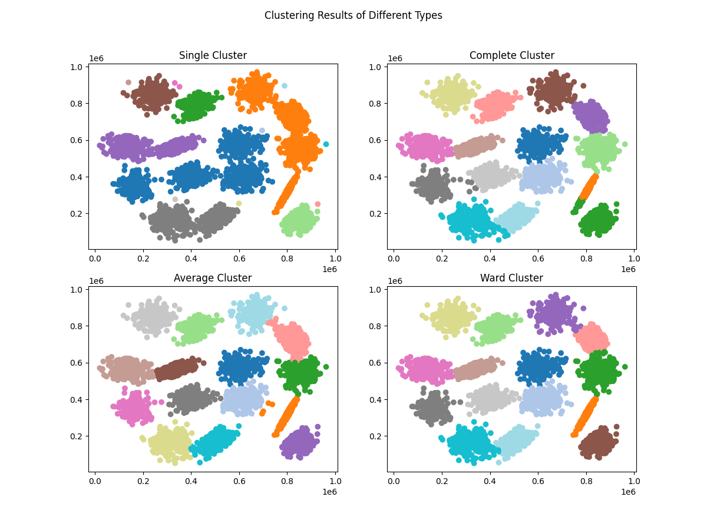
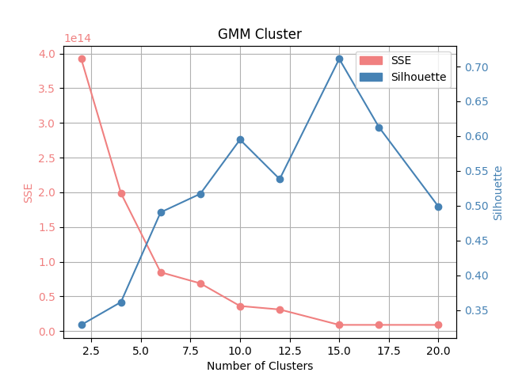

[toc]

## Exercise \#1

> by 24214860 覃梓鑫

### 层次聚类

#### 实现过程

1. 使用 Python，基于手写加权并查集、最小堆等数据结构与算法，**以 $O(n^2\log n)$ 时间、 $O(n^2)$ 空间复杂度优秀地实现了最小、最大、组平均、ward四种层次聚类方法。**(见 `cluster.py` 和辅助代码 `disjointSet.py`, `utils.py`)

2. **使用 `numpy` 数组，重构堆等方法思路，对代码进行了充分的效率优化**，使代码时间空间开销明显降低。优化后，空间节省至少一半，运行时间从上百秒优化到如下：(运行CPU：i7-13620H)

   | 聚类类型 | 最小 | 最大  | 组平均 | ward  |
   | -------- | ---- | ----- | ------ | ----- |
   | 运行时间 | 3.2s | 10.8s | 26.5s  | 14.0s |

运行结果在 `steps_min.txt` 等共四个 `steps_xxx.txt` 文件展示，参见 `cluster.py` 的 `cluster()` 注释例子解释含义。

#### 评价指标

手写实现 SSE 和轮廓系数，利用上述聚类的合并步骤进行计算：(代码详见 `cluster_criteria.py`)

1. SSE 使用并查集实现，能高效用 $O(n)$ 复杂度求出聚成 $1,2,\cdots,n$ 全部类别的结果。
2. 轮廓系数借助 `numpy` 优化，能 $O(n^2)$ 地求出结果。

对四种聚类的计算结果如下：

根据观察结果，SSE 没有拐点，在分为 $15$ 类时取得轮廓系数最大，且除最小聚类外，其他三种聚类指标相似。故分为 $15$ 类，四种聚类结果如下：

观察图像知，最小、最大聚类结果不佳，另两种较好，且ward聚类(图右下结果)更好。

> 篇幅原因，聚类过程等信息展示见 `README.md`。

结果：**综合计算效率、轮廓系数和聚类结果观察，使用ward聚类聚成 $15$ 类效果最优。**

### GMM

#### 实现过程

基于EM(期望最大化)算法实现了 GMM 聚类，使用 numpy 优化了运算。**实现了多种手写初始化策略，可基于随机化、K-means、K-medoids、K-means++来初始化GMM**，经过对比K-means++聚类效果最佳。运行复杂度近似为 $O(n)$，能在1秒内。

#### 参数选择

首先对不同初始化策略实验(聚类$k=15$)，结果表明K-means++初始化GMM最佳。

接着尝试了不同的聚类数目 $k$，观察结果表明 $k=15$ 类效果最佳。

对它们做 SSE 和轮廓系数计算，统计结果同样表明 $k=15$ 最佳。

### 对比

将 ward 层次聚类与 Kmeans++ 初始化的 GMM 结果聚成 $15$ 类对比如下。

可观察到它们都很好地聚成了 $15$ 类，求 SSE 和轮廓系数对比：

| 指标\聚类方法 | 层次聚类                | GMM                     |
| ------------- | ----------------------- | ----------------------- |
| SSE           | $9.054839\times10^{12}$ | $8.942035\times10^{12}$ |
| 轮廓系数      | $0.708545$              | $0.710919$              |

结果表明，GMM 聚类 SSE 略低，轮廓系数略高，故 GMM 稍好于层次聚类。
